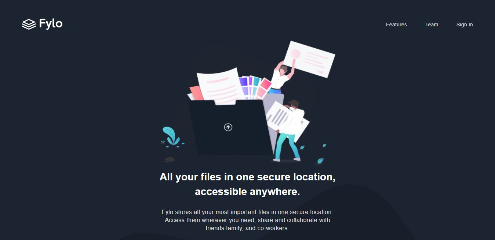

# Frontend Mentor - Fylo dark theme landing page solution

This is a solution to the [Social proof section challenge on Frontend](https://www.frontendmentor.io/challenges/social-proof-section-6e0qTv_bA). Frontend challenges help you improve your coding skills by building realistic projects.

## Author

  - Frontend Mentor: [César Ramez](https://www.frontendmentor.io/profile/ramez-cesar)
  - Twitter: [César Ramez](https://twitter.com/ramez_cesar)
  - Codepe: [César Ramez](https://codepen.io/ramez-cesar)

### Screenshot

### Links

- Live Site URL: [Add live site URL here](https://ramez-cesar.github.io/dark-theme-landing-page/)

## My process

### Built with

- Semantic HTML5 markup
- CSS custom properties
- Flexbox
- Mobile-first workflow